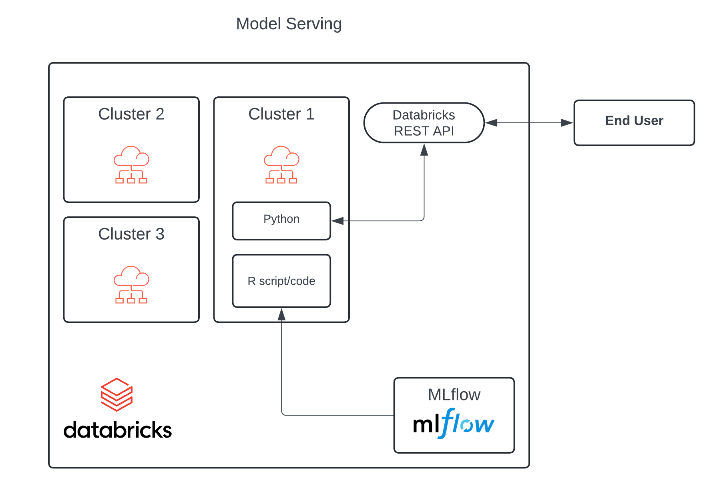

# DBRXR

## Project overview

`dbrxr` is a simple prototype that shows how to host and execute R code in Databricks using API calls. Databricks doesn't currently support serving endpoints for R, and this workarounds enables hosting R code with certain caveats. This functionality relies on an always-on Databricks cluster and uses the `rpy2` Python package, which is exposed via the [Databricks Command Execution API](https://docs.databricks.com/api/workspace/commandexecution) and wraps the R code.

**DISCLAIMER**: *This is a prototype/workaround demonstration. It is not officially endorsed or supported by Databricks.*

### Architecture

This diagram outlines the architecture of the solution.



Here we use a Databricks cluster that is constantly running. Notice that this is not a hard requirement, but a recommendation for having fast and reliable API response times. Instead, the cluster can be configured to run on schedule to reduce cost if API requests within certain time windows are not expected or failures within the time window can be tolerated.

For this solution to function the cluster needs to have a version of [rpy2](https://rpy2.github.io/) installed. This package provides an interface to R, running embedded in a Python process. If we want to be able to pull models and artifacts from [MLflow](https://mlflow.org/docs/latest/index.html), the cluster will also need to have the Python `mlflow` package available too. These can be installed automatically when the cluster starts via [init scripts](https://docs.databricks.com/en/init-scripts/index.html). This repository contains a simple init script named [packages_init.sh](packages_init.sh) that does this.

The `rpy2` package allows us to run R code from Python like this:

```python
import rpy2.robjects as robjects

robjects.r('''
    add_two_numbers <- function(first_num, sec_num) {
        return(first_num + sec_num)
    }
    
    print(add_two_numbers(11, 10))
    print(add_two_numbers(8, 20))
''')
```

On the other hand, the Databricks execution API allows us to submit Python, Scala, and SQL code for execution on a remote cluster. Combining the two gives us a mechanism to run the R code listed above onto a designated cluster (Cluster 1 in the diagram above). Note, that we need to use this workaround as direct submission of R code via the [Command Execution API](https://docs.databricks.com/api/workspace/commandexecution) is currently not supported. `dbrxr` is an MVP demo, which shows how this can be leveraged to run arbitrary R code, including scoring endpoints for R models.

## Usage

This section provides a step-by-step overview of how to deploy an R model as a scoring endpoint using the workaround outlined above. The end-to-end example showcased here is available as a standalone [Python script](demo.py) in this repository.

First, we need to set a number of environment variables to provide the following details to `dbrxr`:

* DBRX_HOST - Databricks [workspace URL](https://docs.databricks.com/en/workspace/workspace-details.html)
* DBRX_API_TOKEN - [Access token](https://docs.databricks.com/en/dev-tools/auth/pat.html) for authentication to the cluster (and MLflow, if needed) 
* CLUSTER_ID - The unique [cluster ID](https://docs.databricks.com/en/workspace/workspace-details.html) identifying the target cluster

Next, we need to create a `DBRXCluster` instance 

```python
import os

from dbrxr import DBRXCluster

api_token = os.environ.get("DBRX_API_TOKEN")
databricks_host = os.environ.get("DBRX_HOST")
api_url = databricks_host + "/api/1.2" # Update to reflect the relevant API version

cluster = DBRXCluster(api_url, api_token)
cluster.cluster_id = cluster_id
```

Note that `cluster_id` is set outside of the constructor. This is because once created, the `DBRXCluster` can be used to interact with different clusters within the same workspace.

The next step is to create an [execution context](https://docs.databricks.com/en/notebooks/execution-context.html).

```python
cluster.create_context("my_execution_context")
```

At this point, if `rpy2` is not already present on the cluster `dbrxr` will try to install it on the fly as this is a critical requirement. Note that if needed, other packaged can be also installed dynamically in the context. However, keep in mind that these installations are ephemeral and is better to have the required packages included in the init script if they are required permanently.

```python
# Installing a Python package


# Installing an R package
cluster.install_R_package("mlflow")
```
